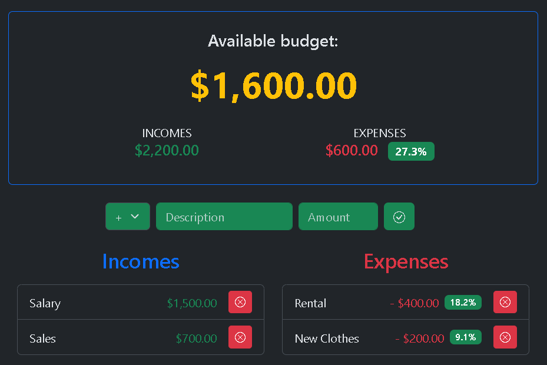
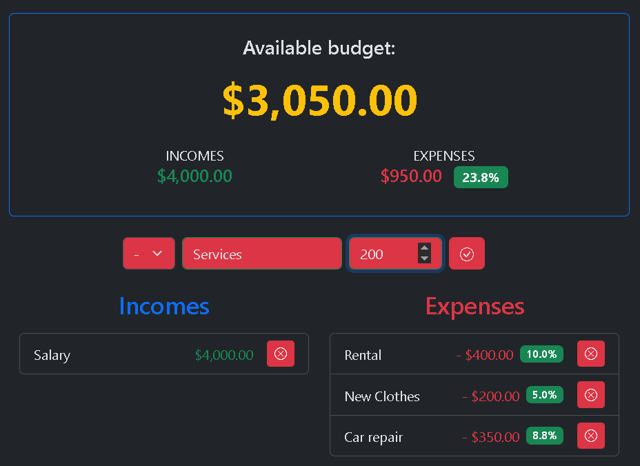

# AppBudget

This web app developed with Angular, allows the user to manage income and expenses, view them in separate lists, and also see the available budget based on the data entered.

## 🚀 Tech stack

- Angular
- TypeScript
- Bootstrap
- Compodoc (for documentation)

## 📦 Instalation

1. Clone repository:
```bash
   git clone https://github.com/EnzoWeimann/AppBudget.git
 ```
2. Enter the project directory:
```bash
   cd AppBudget
```
3. Install dependencies:
```bash
npm install
```

## 🚩 Run application
  ```bash
  ng serve -o
  ```
  It should open automatically in http://localhost:4200

## 📚 Documents

  The documentation was created using CompoDoc. To open it, you must first install the tool:
  ```bash
    npm install --save-dev @compodoc/compodoc
  ```

  And then, to open it in the browser run:
  ```bash
    npm run docs
  ```

## 🖼️ Preview

  
  

## ✅ Need to do for next version
 - Connect to DB for data persistence
